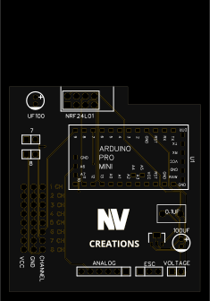
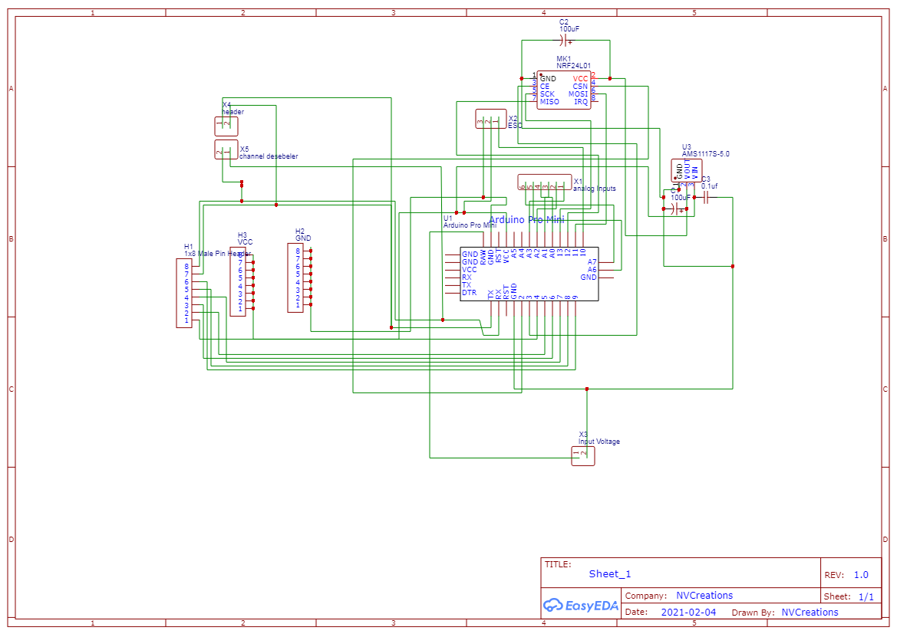
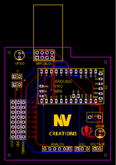

# Arduino-RC-Plane-reciever

This project features a lightweight, 9-channel Arduino-based RC receiver, optimized for use in RC planes. It includes the full Arduino code, a custom-designed PCB, Gerber files for manufacturing, schematic diagrams, and a realistic top-view image of the circuit.

> ⚙️ Designed to be compact and efficient — ideal for small, weight-sensitive RC aircraft.

---

## 🔧 Features

- ✅ 9-Channel control using Arduino
- ✅ Lightweight and minimal-sized PCB layout
- ✅ Optimized for **RC planes**
- ✅ Easily adaptable to **RC cars, boats, or robots** with minor code changes
- ✅ Includes everything from schematics to fabrication files

---

## 📁 Repository Contents

| File/Folder         | Description |
|---------------------|-------------|
| `RC_plane.ino`      | Arduino sketch for 9-channel receiver |
| `EasyEDA.json`      | Original EasyEDA project files (`.json`) |
| `/Greber-File/`     | Complete Gerber files for PCB fabrication |
| `pcb-top-view.svg`  | 2D view of the PCB layout (top side) |
| `PCB-design.png`    | PCB Design |
| `schematic.png`     | Schematic circuit diagram |
| `README.md`         | This file |
| `LICENSE`           | License information (CC BY-NC-SA 4.0) |

---

## 🛠️ Customization

Want to adapt this receiver for a different RC platform?

- Modify a few lines of code (e.g., PWM mapping, motor output pins)
- Use the same PCB for:
  - 🚗 RC Cars
  - 🚤 RC Boats
  - 🤖 RC Robots

No need to redesign or rebuild the hardware!

---

## 📷 Previews

| PCB Top View | Schematic | PCB Design | 
|--------------|-----------|------------|
|  |  |  |

---

## 🧾 License

This project is licensed under the  
**[Creative Commons Attribution-NonCommercial-ShareAlike 4.0 International (CC BY-NC-SA 4.0)](https://creativecommons.org/licenses/by-nc-sa/4.0/)**

- ✅ Free for personal and educational use
- ❌ Commercial use **not allowed** without permission
- 🔄 Modifications must be shared under the same license
- ✏️ Credit must be given to the original creator

---

Feel free to fork, contribute, or suggest improvements.  
**NV Creations** – Freelance Developer | PCB Designer | Problem Solver
